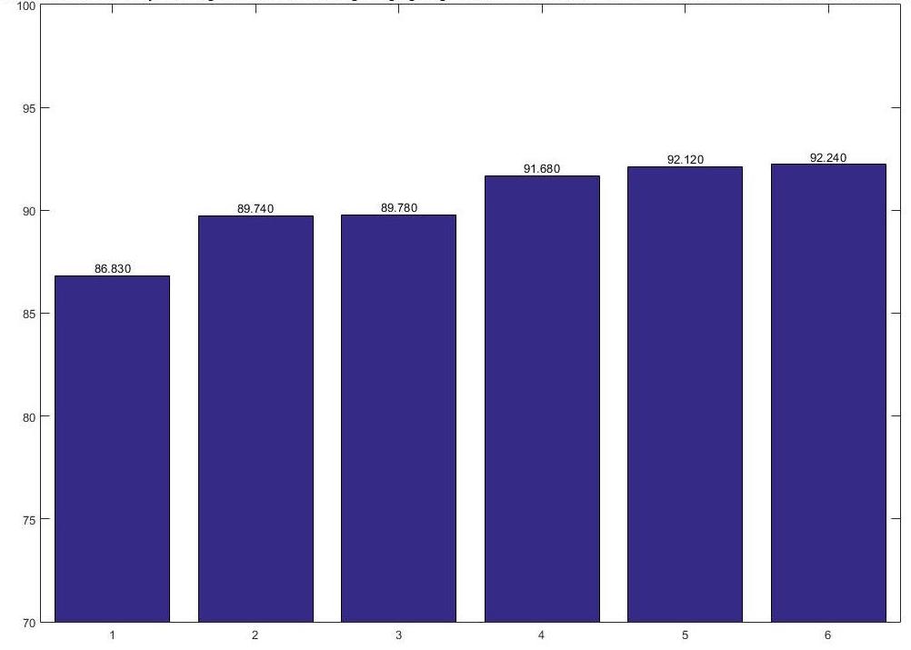

# TwitterGenderClassification
92% prediction accuracy.

Please check [FinalReportRevised/report](FinalReportRevised/report.pdf)

Our team "Woodpecker" ranked 6th on [leaderboard](http://www.seas.upenn.edu/~cis520/fall15/leaderboard.html)

## Visualizations:

- "Mean face" of men and women:

  

- Auto-encoder faces:

- Eigen faces:

- Surf features clusters:

- Top words:

- Logitboost errors:

- Cross-validation accuracies:

