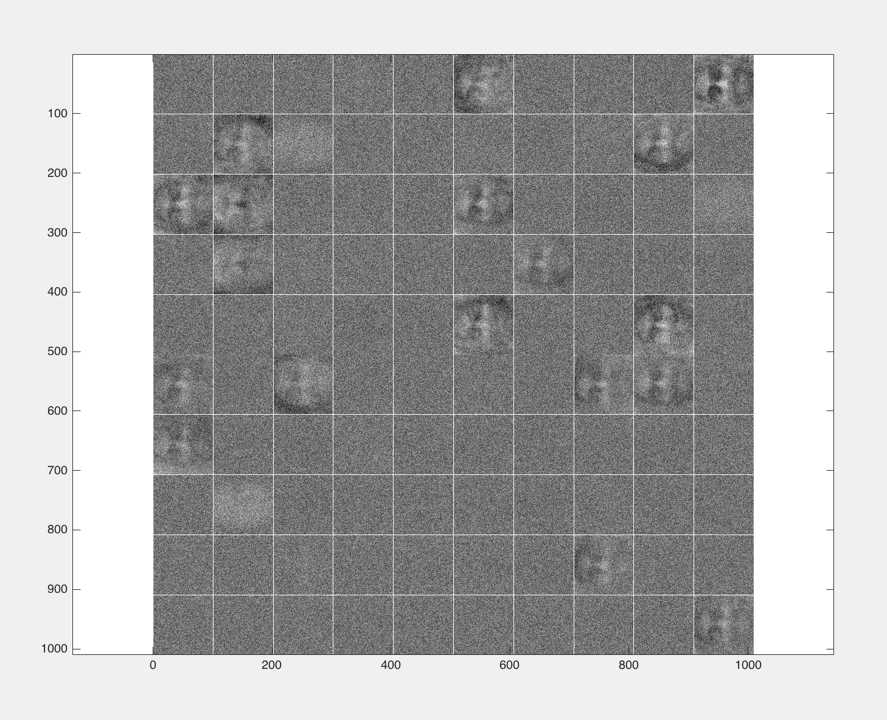
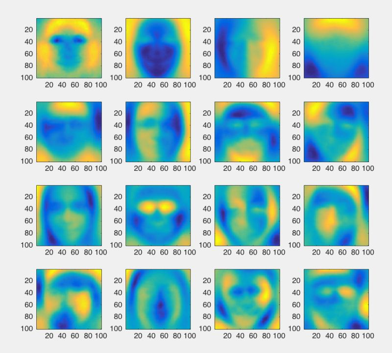
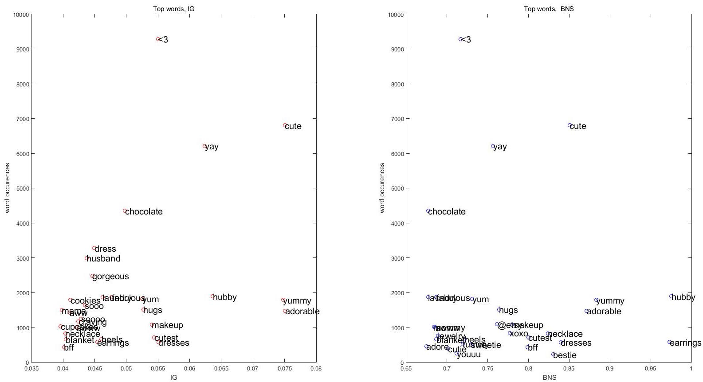
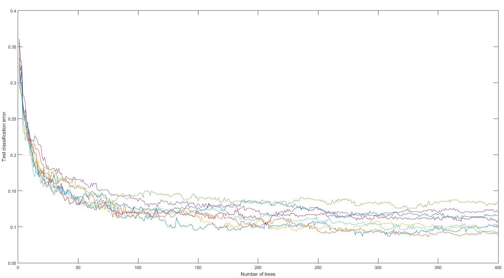

# Twitter Users Gender Classification

University of Pennsylvania fall 2015 CIS 520 Machine Learning course project. Achieved 92% gender prediction accuracy on twitter users' tweets and profile pictures.

- Detailed report can be found at: [FinalReportRevised/report.pdf](FinalReportRevised/report.pdf)
- Project submission readme: [proj_submitB/README.txt](proj_submitB/README.txt)
- Our team "Woodpecker" ranked 6th on [leaderboard](http://www.seas.upenn.edu/~cis520/fall15/leaderboard.html)

Feb 01 2017 update:

- Repo cleaned up. Codes moved to `code/`.

## Visualizations:

- "Mean face" of men and women:

  

- Auto-encoder faces:

- Eigen faces:

- Surf features clusters:

- Top words:

- Logitboost errors:

- Cross-validation accuracies:

